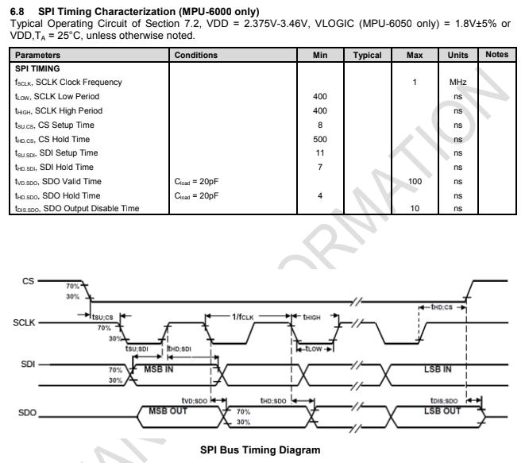

# Final Report - Quad copter Design


**Date:** November 11th, 2022

**Author/Partner:** 유도연/노경하

**Github:** https://github.com/doyounyu/EC-dyu-460

**Demo Video:** https://youtu.be/2NwWJajZSoE


## Introduction

In this final project, we aimed to build quad copter with RF controller that runs with PID control.


## Requirement


### Hardware

- MCU
  - T motor F4 mini - STM32F411RG
  - Arduino Pro Mini
- Sensor
  - MPU6000 Gyroscope Accelerometer sensor
  - PbS Light sensor
- Actuator
  - x4 BLDC Motor with BLHeli-S Electrical Spees Controller
  - SG90 Servo motor
- Others
  - GR-12L RF Receiver
  - 

### Software

- STM32cubeIDE, EC_HAL library


## Overview


MPU6000 6DOF Gyro-Accel Sensor provides angular velocity and axial accelerator to STM32F411EU Processor via SPI communication protocol. MCU then processes the data through a complementary filter code to get accurate, non-drifting Euler angle values for the quadcopter.

​	User command is delivered by MZ-24 Pro Controller using HOTT protocol created by Graupner company. 

​	Then the received signal is converted into SUMD signal through GR-12L receiver, then the signal is received by UART pin in STM32. SUMD does not require a signal inverter as SBUS, but has stronger error recognition by the use of CRC-16 method, which will be explained in detail in the report.

​	For debugging and PID gain tuning another UART cable has been used to communicate with MCU and the PC.

​	When MCU receives data from Gyroscope sensor and user joystick command, STM32 processes given data to move as the user's command and maintain its stability through feedback control by precisely changing four motor’s rotation speed. Motor’s rotation speed is controlled by the Electrical Speed Controller, also known as ESC, which receives a 2kHz PWM signal and sends 3 Phase AC signals to the brushless motors.


​                                                                           **Pin Configuration**


## Flash Settings

because our MCU board has no ST Link debugger inside, we have to use DFU mode to flash our code. detailed steps are as follows.

1. Install STM32CubeProgrammer. (https://www.st.com/en/development-tools/stm32cubeprog.html) 
2.  Generate elf, bin or hex file from your code (cubeIDE automatically generates elf file when your code is built).
3.  Connect MCU board with pc in bootloader mode (connect while BOOT button is pressed).
4. Flash elf, bin or hex file onto your MCU board with STM32CubeProgrammer.


## **Sensor Settings(MPU 6000 Gyro/Acc)**

Because our gyro / accelerometer uses SPI protocol, there are some states before getting data from the sensor. 


For accurate SPI data reading, SPI timing digram from MPU6000 datasheet is configured: 




**Table. States: 6DOF Gyro Sensor Initialization data read process**


To access proper data location, Register Map has configured also.


## **SUMD Receiver protocol**


​	Since bluetooth communication has limited range of control, and zigbee communication requires an external controller, we chose Graupner’s **MZ-24 Pro** Controller and **GR-12L** receiver. 

GR-12L has a range of 2km, and supports different types of receiver signals such as **SBUS, PWM, SUMD**. Since **PWM** requires one line per each signal, and **SBUS** requires a logic inverter, we chose SUMD as our communication protocol. Thankfully, Graupner provides a detailed technical specification document for SUMD communication, we gathered quite a lot of data from it.


As shown in the document, **115200** baudrate, **8N1** setting is needed.


It has **SUMD_Header** sections, which tells us whether the signal received is valid, and **SUMD_Data** sections, which tells us the exact value of each channel’s data, in this case, the joystick / switch input, and lastly, **SUMD_CRC,** which is to do the Cyclic Redundancy Check for 16 bit value.


To impelment those protocol to our code, `sumd.c` and `sumd.h` header has been created. Those header files inclues following functions:


```c
void SUMD_parsing(uint8_t sumd_rx_buf[], SUMD_channel sumd_ch[]);
void ch_data_to_oneShot125(double oneShot125[], SUMD_channel sumd_ch[]);
uint8_t CRC16_check(uint8_t sumd_rx_buf[], uint8_t len);
uint16_t CRC16(uint16_t crc, uint8_t value);
```


The overall state to read data is as follows:


### CRC-16 SICK


```C
uint16_t CRC16(uint16_t crc, uint8_t value)
{
	uint8_t i;
	crc = crc ^ (int16_t)value<<8;
	for(i=0; i<8; i++)
		{
		 if (crc & 0x8000)
		 crc = (crc << 1) ^ CRC_POLYNOME;

		 else
		 crc = (crc << 1);
		}
	return crc;
}
```

 Technical specification document for SUMD also provides what kind of algorithm is used to generate CRC-16. Since there are different types of CRC-16 used, we had to find out which CRC16 algorithm that Graupner used. By generating CRC value through the code given and compared the value with various CRC16 claculator, we figured out that the algorithm that Graupner uses is **CRC16-Sick**. After that we could use the calculator online to debug that our code worked properly.


## **OneShot125**

​	OneShot125 is basically a 2kHz PWM, but slightly different from the PWM used to control regular DC motors. DC motor directly receives PWM value to the coils inside the motor, however, since BLDC motor requires 3-Phase AC signal to operate, ESC chip is needed to create 3-Phase AC signal. 

Then ESC needs to receive a certain type of data to control the speed of the motor, in this case, OneShot125 is the signal. The duty cycle varies between 25% to 50% for minimum(no rotation) and maximum speed, and that can be calibrated by driving the ESC with near 50% duty ratio of PWM directly for a few seconds.


User manual explains in detail how to calibrate esc with desired pulse width - speed.


## Power Distribution Board


To distribute the voltage given from the battery evenly Power Distribution Board, also known as PDB for short from MATEK is used. PDB not only distribute unregulated voltage to ESC's voltage regulator, but also regulates voltage for external use for 5V, 12V using buck - boost converter.


## How it works


#### **Setup loop**

1. Motor pins are initialized with lowest OneShot125 Value to avoid rotating.
2. TIM, GPIO, SPI, USART pins are initialized. Wait for 2 seconds for sensor power up.
3. MPU6000 is initialized.USART RX interrupt is enabled for the update flag.


#### **While loop - 1kHz timer loop**


1. if the 1kHz timer is on, and the gyro is calibrated properly, PID gain is calculated. Explaining PID control in this report seems to be too much, so I will leave that as a youTube suggestion: “Understanding PID Control” playlists by MATLAB tech talk by Brian Douglas. To prevent I-gain windup, anti-windup code to prevent such disaster is used. We learned that anti-windup is mandatory in a really hard way. While tuning the I gain after finishing P, D gain, after only 0.1 I gain increase, the drone lost its control and broke its propeller.

2. Then the PID control loop runs for roll, pitch, and yaw separately.

3. After the error calculations, those values are converted into the pulse width for the motor, then writes the calculated value.

   

#### While loop - sensor data processing loop

1. If gyroscope data interrupt is enabled, and gyro offset is calculated, acceleration and angular velocity is gathered via register read function. 
2. Then the unit of the data is converted based on the sensor settings.After unit conversion, accelerometer data and gyroscope data is processed through complementary filter.
3.  Complementary filter adds Low Pass Filtered accelerometer data and High Pass Filtered integrated gyroscope data to accurately measure the angle.


#### while loop - SUMD received data processing loop

1. Once SUMD RX is completed, CRC16 test is runned.
2. If the test value is valid, convetes the data into the pulsewidth, then write the value into the motor.s


#### Optional - Gain tuning loop

To properly set PID gain without using model based design of quadcopter, which is quite time consuming, we used **Ziegler-Nichols** method to tune the PID gain. To do so, interactive PID gain tuning is required. By connecting UART port to the drone that connects to the PC, we inspect the drone's behavior to set proper PID gain. Q,W,E increases P, I, D gain by certain amount, and A,S,D decreases P,I,D gain by certain amount. Through serial monitor we can inspect which gain has been used to set quadcopter, then change the variable later on.


## Arming sequence

When you tune pid gains or fly drone, you need certain sequence to start drone to prevent drone’s unsafe behavior. It is called **arming**. state table for arming sequence is as follows. 


### Laser Warning System


While operating a drone, guided weapon might lock our drone with laser to neutralize it. To avoid such catastrophic situation, we mounted CdS analog sensor under the drone with servo motor to detect laser lock and send beep to warn user that laser is detected. if laser is detected, buzzer sends short beep, or long beep depends on the strength of the laser. To distinguish the distance, `#define` is used. Arduino pro mini was used to maximize its capability.


| PIN  | Function                          |
| ---- | --------------------------------- |
| A1   | INPUT: CdS value ADC              |
| 3    | OUTPUT: PWM input for buzzer      |
| 5    | OUTPUT: PWM input for servo motor |


```c
#include <Servo.h>
#define FAR 100
#define MID 80
#define CLOSE 60
int servoPin = 5;

Servo servo;

double x = 0; // servo position in degrees

int CDS = A1; 
int buz = 3;    

void setup() 
{
  Serial.begin(9600);
  pinMode(CDS, INPUT); 
  servo.attach(servoPin);
}

void loop() {
  CDS = analogRead(A1);    
  Serial.print("CDS_Sensor: ");
  Serial.println(CDS);       
  if (CDS > FAR)  noTone(buz);

  else 
  { 
    if (CDS < FAR && CDS > MID)
    {
      tone(buz, 1000, 50);
      delay(200);
    }
    if (CDS < MID && CDS > CLOSE)
    {
      tone(buz, 1000, 50);
      delay(100);
    }

    else if (CDS < CLOSE)
    {
      tone(buz, 1000, 50);
      delay(50);
    }
  }
  servo.write(90 * sin(x) + 90);
  x += 1;
  delay(100);
}

```


Also, sinusoidal signal is given to the servo's pulsewidth to smoothly rotate the servo motor in both direction.


## Conclusion

We achieved what we wanted, but there was a problem that the battery was cold and quickly consumed, and there was a problem of proper control. In addition, the resolution of the ccr value of PWM was too small to be controlled due to quantization. We have fixed the issue, but unable to test the update because of the wether issue. However, as a result of using what we learned in embedded controller classes or other major classes so far, we were able to learn a lot from the project.


## User Defined Functions


### `void SUMD_parsing(uint8_t sumd_rx_buf[], SUMD_channel sumd_ch[])`

This function parses raw SUMD buffer data to SUMD channel data array, after shifting and calculating raw data.


**Parameters**

* `uint8_t sumd_rx_buf[]`: recieved raw SUMD buffer data from receiver.

* `SUMD_channel sumd_ch[]`: buffer that stores converted channel data.


### `void ch_data_to_oneShot125(double oneShot125[], SUMD_channel sumd_ch[])`

This function converts channel data to pulsewidth value for 2kHz oneShot125.


**Parameters**

* `oneShot125[]`: pulsewidth-converted channel data.
* `SUMD_channel sumd_ch[]`: buffer that stores converted channel data.
* 

### `uint8_t CRC16_check(uint8_t sumd_rx_buf[], uint8_t len)`

This function runs CRC-16 to validate the received data corruption for all `sumd_rx_buf[]`.


**Parameters**

`uint8_t sumd_rx_buf[]`: recieved raw SUMD buffer data from receiver.

`len`: length of the data that will run CRC16.


### `uint16_t CRC16(uint16_t crc, uint8_t value)`

This function runs CRC-16.


**Parameters**

`crc`: value that will divide `value`.

`value`: value that will be divided by `crc`.


### `void PWM_2kHz_init(PWM_t *pwm, GPIO_TypeDef *port, int pin)`


This function initializes PWM with 2kHz frequency. It has much better CCR value resolution than PWM_init(). 

**Parameters**

* `pwm`: PWM struct incluing port, pin, timer and channel.

* `port`: GPIO port

* `pin`: Pin number


### `void PWM_2kHz_pulsewidth_us(PWM_t *pwm, float pulse_width_us)`

Generates the PWM pulses with user selected pulsewidth.

**Parameters**

* `pwm`: PWM struct incluing port, pin, timer and channel.

* `port`: GPIO port

* `pin`: Pin number


### `void TIM_2kHz(TIM_TypeDef *TIMx)`

Set timer frequency to 2kHz. This fuction only works in 96MHz clock.

**Parameters**

* `TIMx` : Timer name


